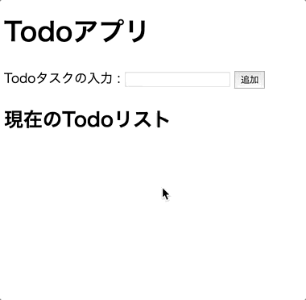

# レポジトリ内容

このレポジトリは[Web白熱教室](https://tsuyopon.xyz/)の[JavaScriptの学習コンテンツ > JavaScriptフロントエンド編](https://tsuyopon.xyz/learning-contents/web-dev/javascript/frontend/)にある「[【エクササイズ】Todoリストを作成する](https://tsuyopon.xyz/learning-contents/web-dev/javascript/frontend/js-excercise-for-frontend-4/)」で利用するものです。

### 完成形

## 課題

以下の「課題をクリアするためのステップ」の内容を全て対応して、`index.html`をブラウザで開き、デベロッパーツールのConsoleを開いたときに上記「完成形」と同じものが表示されるようにする

### 課題をクリアするためのステップ

1. [ ] main.jsの中のコメントに記述されている課題をクリアしてください。

## 答え

- htmlの答えは `answer.html` に記述しています。(answer.htmlをブラウザで開くと正解の挙動を確認できます。)
- jsの答えは `answer.js` に記述しています。
- 全く作業が進められなくなったときに答えを参考にしても良いですが、コピー&ペーストは厳禁です
- 答えを見ながら実装をしたら、もう一度、今度は答えを見ないで実装してください(以下の参考記事を見るのは可能)

## 参考記事

課題をこなしていて、行き詰まったら以下の資料を参考にしていただければ解答にたどり着けるかと思います。

- Web白熱教室
  - [【JavaScript】HTMLの特定の要素(DOM)を取得する](https://tsuyopon.xyz/learning-contents/web-dev/javascript/frontend/how-to-get-dom-from-html/)
  - [【JavaScript】DOMのテキスト内容を取得・変更する](https://tsuyopon.xyz/learning-contents/web-dev/javascript/frontend/how-to-manipulate-text-in-dom/)
  - [JavaScriptで新規作成したDOMを別のDOMに追加する](https://tsuyopon.xyz/learning-contents/web-dev/javascript/frontend/how-to-create-an-dom-and-append-child/)
  - [JavaScriptで特定の要素を削除、子要素を全削除する](https://tsuyopon.xyz/learning-contents/web-dev/javascript/frontend/how-to-remove-dom/)
  - [【JavaScript】DOMをクリックしたときの処理を実装する](https://tsuyopon.xyz/learning-contents/web-dev/javascript/frontend/how-to-add-click-event-with-dom/)
  - [【JavaScript】DOMを使って入力ボックスの値を操作する](https://tsuyopon.xyz/learning-contents/web-dev/javascript/frontend/how-to-manipulate-input-elements-with-dom/)